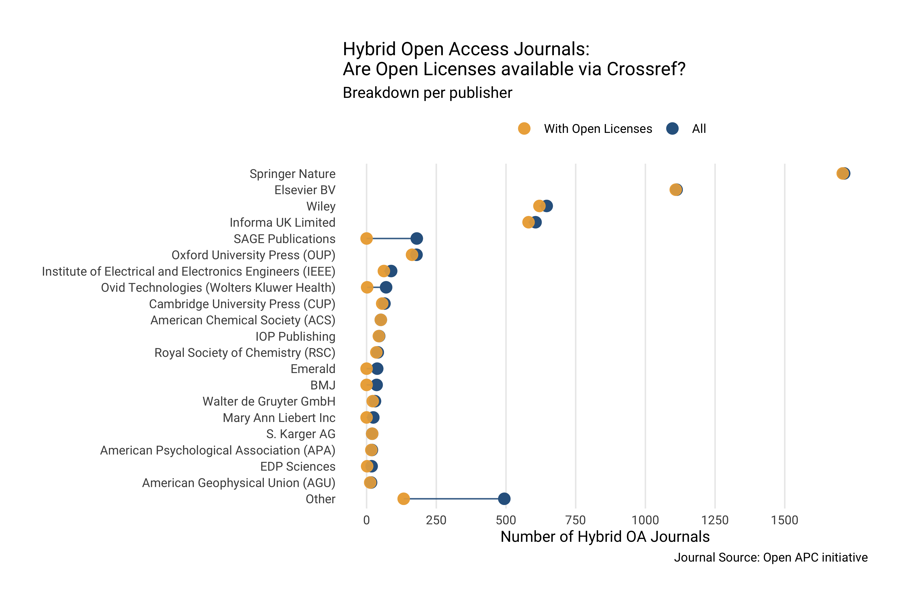

About
================

This open source dashboard presents the uptake of hybrid open access for 2,905 journals from 30 publishers between 2013 - 2017 that meet the following two conditions:

1.  academic institutions sponsored the publication fee or have agreed upon an offsetting aggrement according to the [Open APC initiative](https://github.com/openapc/openapc-de),
2.  publishers shared licensing information about fulltext accessibility and re-use rights with [Crossref](https://www.crossref.org/), a DOI minting agency for scholarly literature.

By bringing together openly available datasets about hybrid open access into one easy-to-use tool, this dashboard demonstrates how existing pieces of an evolving and freely available data infrastructure for monitoring scholarly publishing can be re-used to gain a better understanding of hybrid open access publishing. It, thus, contributes to recent calls from [OA2020](https://oa2020.org/) and [Open Knowledge](https://blog.okfn.org/2017/10/24/understanding-the-costs-of-scholarly-publishing-why-we-need-a-public-data-infrastructure-of-publishing-costs/) aiming at an informed debate about how to transition subscription-based journal publishing to open access.

Coverage
--------

Many publishers offer hybrid open access journals. However, because of non-standardized practices to report open access, it is hard to keep track of how many articles were made immediately available in this way, and how these figures relate to the overall article volume (Björk 2017).

After gathering a sample of hybrid open access journals from the Open APC initiative, Crossref metadata was used to identify open access articles published in these journals. Although Crossref thoroughly covers open access journals, not all publishers share comprehensive metadata about access and re-use including licenses and embargo date via Crossref. In our case, 30 publishers provided licensing metadata via the Crossref API, representing 22 % of all publishers included in our study. At the journal-level, 72 % of all hybrid open access journal titles covered by the Open APC initiative share proper licensing metadata with Crossref.

 *Figure: Overview of Crossref licensing coverage per publisher. Yellow dots represent the number of hybrid open access journals disclosed by the Open APC initiative with licensing metadata, blue dots the overall number of hybrid open access journals in our sample.*

As a publisher, how can I support proper hybrid open access monitoring?
-----------------------------------------------------------------------

Crossref supports publishers who wish to make licensing metadata available via the Crossref APIs: <https://support.crossref.org/hc/en-us/articles/214572423-License-metadata-Access-Indicators->

As a publisher to be best represented in this dashboard, make sure to include license URL element `license_ref` and a `start_date` equal to the date of publication. Such workflow complies with ESAC's recommendations for article workflows and services for offsetting / open access transformation agreements (Geschuhn and Stone 2017).

Bibliography
------------

Björk, Bo-Christer. 2017. “Growth of Hybrid Open Access, 2009 Textendash2016.” *PeerJ* 5: e3878. <https://doi.org/10.7717/peerj.3878>.

Geschuhn, Kai, and Graham Stone. 2017. “It’s the Workflows, Stupid! What Is Required to Make ‘Offsetting’ Work for the Open Access Transition.” *Insights the UKSG Journal* 30 (3): 103–14. <https://doi.org/10.1629/uksg.391>.
